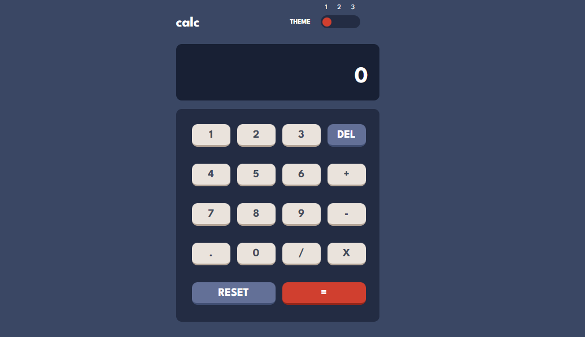

# FM - Calculator App

This is a solution to the [Calculator app challenge on Frontend Mentor](https://www.frontendmentor.io/challenges/calculator-app-9lteq5N29). Frontend Mentor challenges help you improve your coding skills by building realistic projects. 

## Table of contents

- [FM - Calculator App](#fm---calculator-app)
  - [Table of contents](#table-of-contents)
  - [Overview](#overview)
    - [The challenge](#the-challenge)
    - [Used Technologies](#used-technologies)
    - [Screenshot](#screenshot)
    - [Links](#links)
  - [Author](#author)

## Overview

### The challenge

Users should be able to:

- View the optimal layout depending on their device's screen size.
- Able to perform basic operations like addition, subtraction, multiplication, and division.
- User can choose theme based on there preferance.

### Used Technologies

- HTML5
- CSS3 custom properties
- JavaScript

### Screenshot

### Links

- Solution URL: [Click Here](https://debarunmitra.github.io/FM-CalculatorApp/)

## Author

- Github - [DebarunMitra](https://github.com/DebarunMitra/FM-CalculatorApp/)
- Frontend Mentor - [@DebarunMitra](https://www.frontendmentor.io/profile/DebarunMitra)
- LinkedIn - [DebarunMitra](https://www.linkedin.com/in/debarunmitra876665190/)
